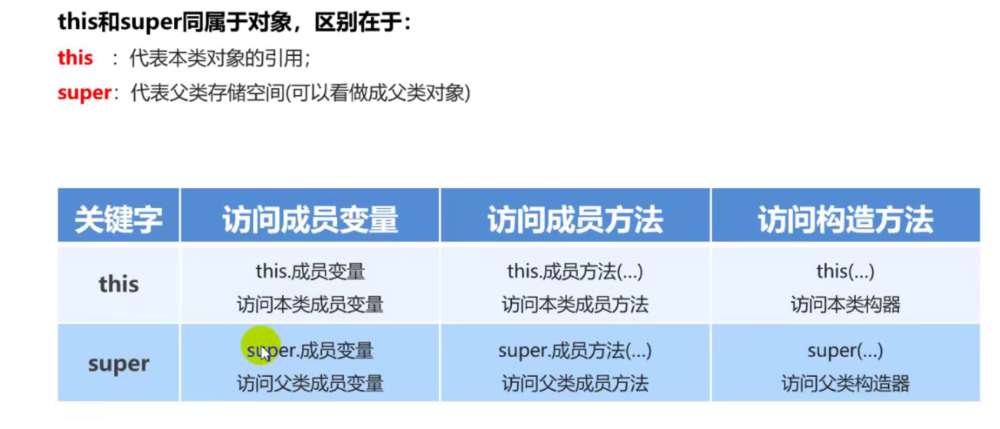

# 继承

## 继承格式

```java
public class Child extends Parent {
    
}
```

## 注意

Java中类与类只支持单继承，不能多继承，但可以多层继承。

## 继承的优点

1.提高代码的复用性

2.提高代码的可维护性

3.让类与类之间产生关系

## 规范

将公共的属性和方法抽取到父类中

## 子类继承父类后成员变量的访问特点

1.先在子类的局部范围找

2.然后子类成员范围找

3.然后父类的成员范围找，找不到就报错

父类中的私有成员子类不能直接访问

## 方法的重写

子类和父类出现**一模一样**的方法。

### 什么时候重写

当父类的功能不能满足子类的需求

```java
public class Child extends Parent {
    @Override
    public void call(String s) {}
}
```

### 重写注意

1.方法名和参数保持一致

2.私有方法不能重写

3.@override：注解，检测被修饰的方法是否是重写父类的方法

4.子类的返回值类型可以是父类返回值类型的子类

权限：public > protected > 默认 > private

## 继承中构造函数

子类的构造函数默认会执行父类的空参构造函数。

### this 和 super



#### 注意
访问构造方法的方式必须在构造方法中：this(), super()

## 抽象类

如果类中存在抽象方法，那么这个类必须是抽象类；

抽象方法没有函数体；

抽象类不能实例化；

抽象类中可以有抽象方法和非抽象方法；

子类继承抽象类，那么子类要么重写抽象方法，要么子类也是抽象类；

```java
public abstract class Lei {
    public abstract eat();
}
```
### 使用场景

当一个父类定义一个方法时，每个子类对应的方法实现逻辑不一样，那父类可以定义成抽象类。

_**抽象类是一种规范，让子类不许重写自己的抽象方法**_


