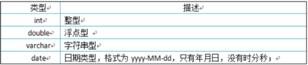

# MySQL 常用命令

1.mysql -u root -p
    -u: user 表示用户，root表示超级管理员
    -p：password密码

2.mysql -uroot -p1234也可以登录

3.mysql -u root -p 和 mysql -uroot -p密码 都是连接本地数据库

4.连接远程：
    mysql [-h 127.0.0.1 -P 3306] -uroot -p1234
    h: host 连接服务器的IP地址
    P: port 端口号

# 注释

单行：-- 和 #
多行：/* 注释 */

# SQL分类

DDL(Data Definition Language)：操作数据库，表等

DML(Data Manipulation Language) ：对表中的数据进行增删改(掌握)

DQL(Data Query Language) ：对表中的数据进行查询(掌握)

DCL(Data Control Language)：对数据库进行权限控制

# DDL -- 操作数据库

注意：分号是结束语句标志；

查询：
    SHOW DATABASES;
创建：
    创建数据库：
        CREATE DATABASE 是数据库名称;
    创建数据库(判断，如果不存在则创建)：
        CREATE DATABASE IF NOT EXISTS 数据库名称;
删除：
    删除数据库：
        DROP DATABASE 数据库名称;
    删除数据库(判断，如果存在则删除)：
        DROP DATABASE IF EXISTS 数据库名称;
使用数据库
    查看当前使用的数据库
        SELECT DATABASE();
    使用数据库：
        USE 数据库名称;

# DDL -- 操作数据表

查询：

    查询当前数据库下所有表名称：
        SHOW TABLES;
    查询表结构：
        DESC 表名称
    查看创建表的SQL语句
        SHOW CREATE TABLE 表名;

创建表：

    CREATE TABLE 表名称 (
        字段名1 数据类型1,
        字段名2 数据类型2,
        字段名3 数据类型3
);

快速创建一个表结构相同的表: 

    CREATE TABLE 表名 LIKE 其他表;

最后一行不加逗号；  

例子：

CREATE TABLE STUDENT (
    id int,
    name varchar(10),
    
)

删除表：

    直接删除表: 
        DROP TABLE 表名;
    判断表是否存在并删除表:
        DROP TABLE IF EXISTS 表名;

修改表：

        修改表名
            RENAME TABLE 旧表名 TO 新表名;
        添加表列
            ALTER TABLE 表名 ADD 字段名/列名 类型;
        修改列类型
            ALTER TABLE 表名 MODIFY 字段名 新的类型;
        修改列名
            ALTER TABLE 表名 CHANGE 旧字段名 新字段名 类型;
        删除列
            ALTER TABLE 表名 DROP 字段名;
        修改字符集
            ALTER TABLE 表名 character set 字符集;
    

