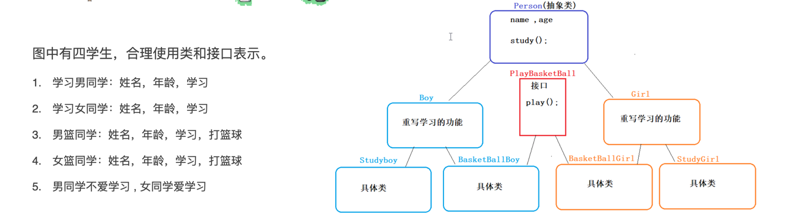

# 类与接口

## 类和类的关系

继承关系，只能单继承，但是可以多层继承

## 类和接口的关系

实现关系，可以单实现，也可以多实现，还可以在继承一个类的同时实现多个接口

## 接口和接口的关系

继承关系，可以单继承，也可以多继承

# 抽象类与接口关系

## 相同点

1.都不可以实例化；

## 不同点

1.成员区别
    抽象类成员变量：可以是常量也可以是变量
    接口：只能是常量

2.成员方法
    抽象类：可以是抽象的，也可以是非抽象
    接口：
            JDK8前：只能是抽象方法
            JDK8:   增加了默认方法和静态方法
            JDK9:  增加了私有方法

3.构造方法
    抽象类：有
    接口：没有

事物的*共性内容*（属性，行为），抽取到父类中（可以是**抽象类**）
_特有的行为_，可以抽取到**接口**中

